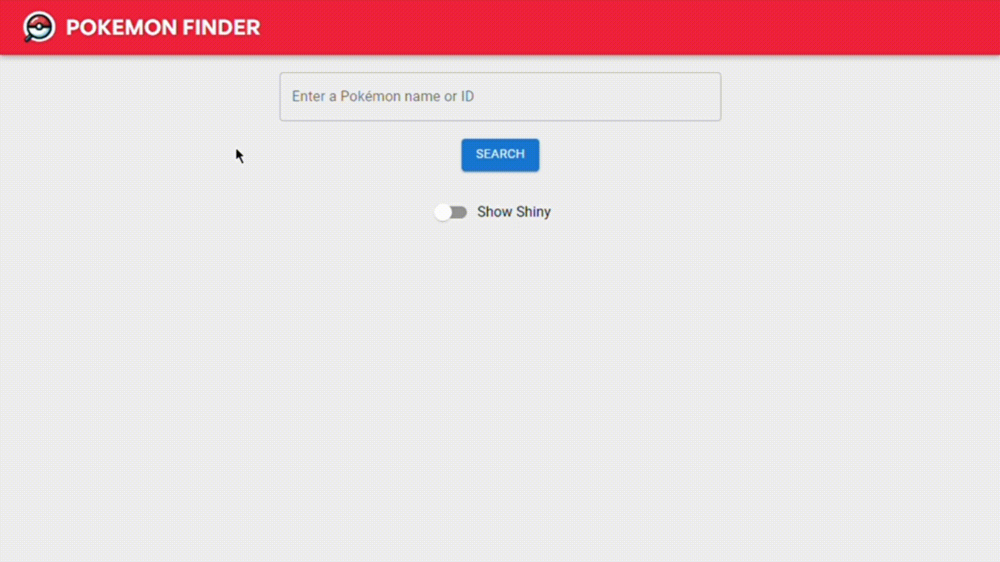

# Pokemon Finder

Pokemon Finder is a simple web application built with React that allows users to search for Pokémon by name or ID. Utilizing the PokéAPI, it provides detailed information about each Pokémon, including its type, abilities, and the games it appears in.

<p>
  <a href="./src/assets/images/pokemonFinderDemo.gif" target="_blank" rel="noreferrer">
    
  </a>
</p>

## Prerequisites

Before you begin, ensure you have met the following requirements:

- Node.js installed on your machine (version 12.x or later recommended).
- npm (Node Package Manager) or Yarn, depending on your preferences for managing JavaScript packages.

## Installation

**Clone the repository:**
```bash
git clone https://github.com/axelfrache/PokemonFinder.git
cd PokemonFinder
```

**Install the required packages:**
- Using npm:
```bash
npm install
```
- Or using Yarn:
```bash
yarn
```

**Run the application:**
- Using npm:
```bash
npm start
```
- Or using Yarn:
```bash
yarn start
```
This will launch the React application in your default web browser. The app typically runs on http://localhost:3000.

## Usage

To use React Pokemon Finder, follow these steps:

1. **Open the application** in your web browser. You should see a search bar with the text "Enter a Pokémon name or ID".

2. **Enter a Pokémon name or ID** in the search bar. The name is not case sensitive, and leading zeros in an ID can be omitted.

3. **Click the "Search" button** or press enter to submit your search.

4. **View the Pokémon's details** displayed below the search bar. If the Pokémon cannot be found, an error message will be displayed.

## Features

- Search for Pokémon by name or numerical ID.
- View detailed information about each Pokémon, including types, abilities, and game appearances.
- Responsive design for viewing on various devices.

## Contributing
Contributions to Pokemon Finder are welcome!

1. **Fork the repository** on GitHub.
2. **Clone your fork** to your local machine.
   ```sh
   git clone https://github.com/your-username/ReactPokemonFinder.git
   ```
3. **Create a new branch** for your features or fixes.
   ```sh
   git checkout -b feature/{feature-name}
    ```
4. **Commit your changes** with descriptive commit messages.
    ```shell
    git commit -m "Add feature description"
    ``` 
5. **Push your branch** to your fork.
   ```sh
   git push origin feature-name
    ```
6. **Open a pull request** against the main repository.

Please refer to the [contribution guidelines](./CONTRIBUTING.md) for detailed instructions.

## Issue and Pull Request Templates

When opening an issue, please use the appropriate template:

- [Bug Report](.github/ISSUE_TEMPLATE/bug_report.md)
- [Feature Request](.github/ISSUE_TEMPLATE/feature_request.md)

For pull requests, ensure you follow the [pull request template](.github/PULL_REQUEST_TEMPLATE.md)